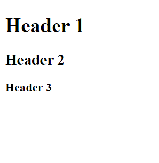
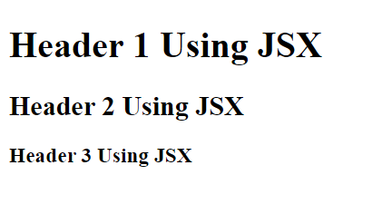
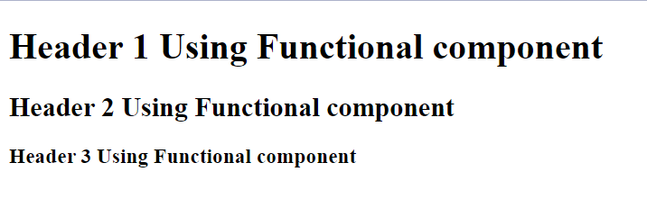
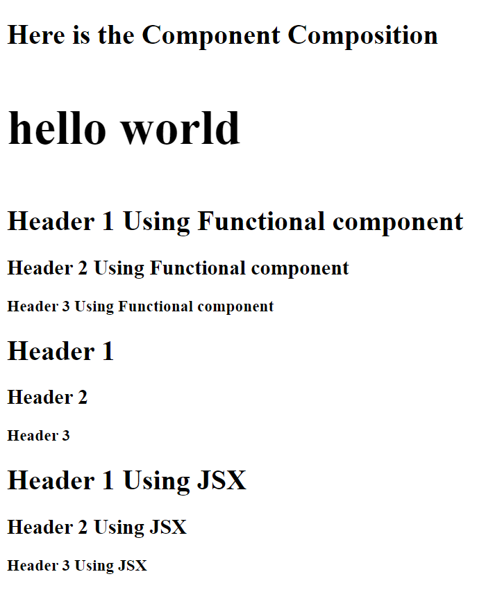
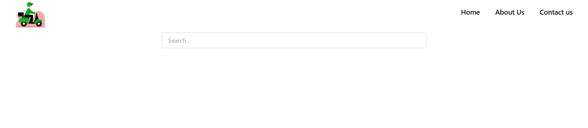

<div align="right"> 
  
## [Assignment 04 >>](https://github.com/vaibhav1281/Namaste-React/blob/main/React-Day-4/README.md)
</div>

# Assignment 03
### Q.1. Create a Nested header Element using React.createElement(h1,h2,h3 inside a div with class "title")

### Code

```jsx
/**
*   <div className="title">
*       <h1>Header 1</h1>
*       <h2>Header 2</h2>
*       <h3>Header 3</h3>
*   </div>
*/

import React from "react";
import  ReactDOM  from "react-dom";

const element = React.createElement(
    'div',
    { className: 'title' },
    React.createElement('h1', {}, 'Header 1'),
    React.createElement('h2', null, 'Header 2'),
    React.createElement('h3', {}, 'Header 3')
);

const root = ReactDOM.createRoot(document.getElementById("root"));
root.render(element);

```

<h3>Output</h3>


### Q.1.1 Create the same element using JSX.

### Code

```jsx
import React from "react";
import  ReactDOM  from "react-dom";

const jsxElement = (
    <div className="title">
        <h1>Header 1 Using JSX</h1>
        <h2>Header 2 Using JSX</h2>
        <h3>Header 3 Using JSX</h3>
    </div>
);

const root = ReactDOM.createRoot(document.getElementById("root"));
root.render(jsxElement);

```

<h3>Output</h3>


### Q.1.2. Create a functional component of the same with JSX.

### Code

```jsx

import React from "react";
import  ReactDOM  from "react-dom";

const Element1 = () => {
    return(
        <div className="title">

            <h1>Header 1 Using Functional component</h1>
            <h2>Header 2 Using Functional component</h2>
            <h3>Header 3 Using Functional component</h3>
            
        </div>
    );
};

const root = ReactDOM.createRoot(document.getElementById("root"));
root.render(<Element1/>);

```

<h3>Output</h3>


### Q.1.3. Composition of Component (Add a component inside another)

### Code

```jsx
import React from "react";
import  ReactDOM  from "react-dom";

/**
 *  <div className="title">
 *      <h1>
 *          <h2>
 *              <h3></h3>
 *          </h2>
 *      </h1>
 *  </div>
 */


const heading = React.createElement(
    "div",
    {className:"title"},
    React.createElement(
        "h1",
        {},
        React.createElement(
            "h2",
            {},
            React.createElement(
                "h3",
                {},
                "hello world"
            )
        )
    )
);


/**
*   <div className="title">
*       <h1></h1>
*       <h1></h1>
*       <h1></h1>
*   </div>
*/

const element = React.createElement(
    'div',
    { className: 'title' },
    React.createElement('h1', {}, 'Header 1'),
    React.createElement('h2', null, 'Header 2'),
    React.createElement('h3', {}, 'Header 3')
);

// Creating Same element using JSX

const jsxElement = (
    <div className="title">
        <h1>Header 1 Using JSX</h1>
        <h2>Header 2 Using JSX</h2>
        <h3>Header 3 Using JSX</h3>
    </div>
);

// Create a functional component of the same with JSX

const Element1 = () => {
    return(
        <div className="title">

            <h1>Header 1 Using Functional component</h1>
            <h2>Header 2 Using Functional component</h2>
            <h3>Header 3 Using Functional component</h3>
            
        </div>
    );
};

// Component Composition

const ComponentComposition = () => {
    return(
        <div>
            <h1>Here is the Component Composition</h1>
            {heading}
            <Element1/>
            {element}
            {jsxElement}
        </div>
    );
}
  
const root = ReactDOM.createRoot(document.getElementById("root"));
root.render(<ComponentComposition/>);

```
<h3>Output</h3>


<h1> Q.2. Create a Header Component from scratch using Functional Components with JSX
    <ul>
        <li>Add a Logo on left</li>
        <li>Add a search bar in middle</li>
        <li>Add User icon on right Add CSS to make it look nice</li>
    </ul>
</h1>    

## Code 

```jsx
import React from "react"
import ReactDOM from "react-dom/client"
import logo from "./images/logo.png"

const Heading = () => {
  return(
    <div>
      <div className="flex justify-between w-full h-[80px]">

        
        
        <div className="">
          <ul className="flex flex-row space-x-10 text-lg mt-5 mr-10 font-semibold">
            <li><a href="#">Home</a></li>
            <li><a href="#aboutus">About Us</a></li>
            <li><a href="#contactus">Contact us</a></li>
          </ul>
        </div>


      </div>

      <div className="w-full h-10 flex items-center justify-center">
        <input
            type="text" 
            name="" 
            id="" 
            placeholder="Search..." 
            className="border border-gray-300 rounded py-2 px-4 w-[45%] mt-4"
            
        />
      </div>


    </div>
  )
}

const root = ReactDOM.createRoot(document.getElementById("root"));
root.render(<Heading/>)
```

## Output



<div align="right"> 
  
## [Assignment 04 >>](https://github.com/vaibhav1281/Namaste-React/blob/main/React-Day-4/README.md)
</div>
